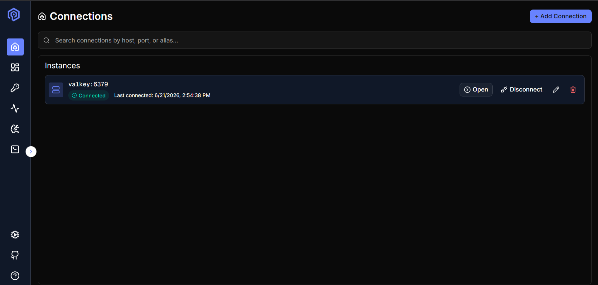
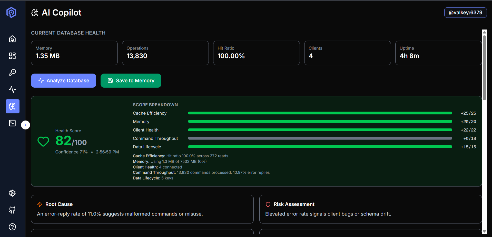
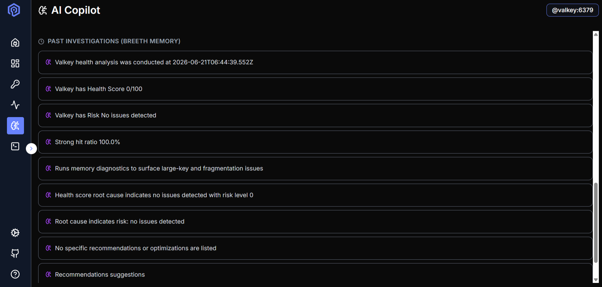
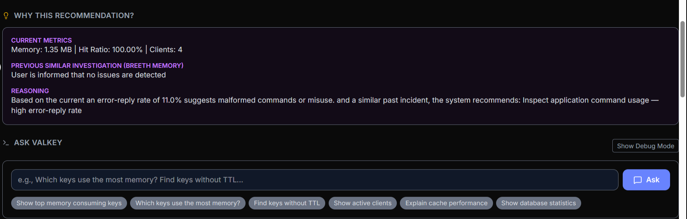

# Valkey Admin

Valkey Admin is an AI-assisted administration dashboard for Valkey, built to help developers and operators monitor database health, investigate incidents, and interact with their data layer more effectively.

---

## Attendee/Team Details

**Name:** ANSHUL NAUTIYAL  
**GitHub Username:** ANSHUL-REAL  
**LinkedIn Profile:** https://www.linkedin.com/in/anshul-nautiyal-42760236b/  
**GitHub Project Repository:** https://github.com/ANSHUL-REAL/valkey-admin  
**Participation:** Solo submission  
**Team Name:** BYTE

---

## Problem Statement Selected

#67 Valkey Admin

---

## Project Description

Valkey Admin is a modern administration interface for Valkey databases and clusters, extended with an AI Copilot workflow for troubleshooting and operational guidance.

The project is for developers, operators, and teams who want a simpler way to inspect database health, understand incidents, and act on issues without leaving their admin workflow. It helps users monitor live metrics, analyze cluster behavior, retrieve similar past investigations, and translate plain-English prompts into safe Valkey command suggestions.

---

## Approach

I approached the problem by starting with the core Valkey Admin experience and making it more useful for day-to-day operational debugging.

The main flow I focused on was:

1. Connect to a Valkey instance.
2. Inspect health and runtime metrics.
3. Analyze issues through an AI Copilot panel.
4. Save findings into Breeth memory.
5. Reuse earlier investigations and ask follow-up database questions in natural language.

AI is used in two important ways:

1. To analyze current Valkey metrics and produce a health score, root-cause hints, risk assessment, and recommendations.
2. To translate natural-language prompts into safe read-only Valkey command intent for the "Ask Valkey" workflow.

What makes this approach useful is that it combines observability, AI assistance, and memory-backed investigation history in one admin tool instead of forcing users to jump between separate dashboards and notes.

---

## Tech Stack and Tools Used

**Frontend:** React, TypeScript, Vite, Tailwind CSS  
**Backend:** Node.js, Express, TypeScript  
**Database:** Valkey  
**AI Tools/API:** Breeth AI, Gemini API  
**Cloud/Deployment:** Hosted locally with Docker  
**Other Tools:** Git, GitHub, npm, Docker Compose

---

## Key Features

1. Valkey connection management for quickly connecting to local instances.
2. AI Copilot health analysis with score breakdown, root-cause hints, and recommendations.
3. Breeth-backed memory for storing and revisiting past investigations.
4. "Ask Valkey" natural-language workflow for safe command assistance.
5. Integrated admin experience that keeps database monitoring and AI debugging in one place.

---

## What is Working?

The project currently supports local Valkey connection through Docker, the Valkey Admin interface, AI Copilot metrics analysis, Breeth memory-backed investigation history, and the Ask Valkey recommendation flow. The frontend integration, backend API routes, and Docker-based local setup are all working together for the showcased flow.

---

## What is Still in Progress?

I still want to improve the polish of the AI Copilot experience, strengthen validation around generated recommendations, and expand the troubleshooting flow with richer suggestions and better production-ready deployment support.

---

## Screenshots or Demo

**Deployed Link:** Hosted locally using Docker  
**Demo Video Link:** N/A  
**Screenshots:**

**Connections Screen**  

**AI Copilot Health Analysis**  

**Past Investigations in Breeth Memory**  

**Ask Valkey Recommendation Workflow**  

---

## Challenges Faced

One of the biggest challenges was integrating AI workflows into an existing admin tool without making the experience unsafe or confusing. I also had to keep the Breeth API key and AI integrations server-side so secrets would not leak into the browser. Another challenge was designing the recommendation flow so it stays useful for operators while remaining grounded in current Valkey metrics and recent investigation history.

---

## Learnings

I learned a lot about combining database observability with AI-assisted workflows in a practical way. This project also helped me understand safe natural-language command interpretation, backend API mediation for secret management, and how persistent memory can improve repeated troubleshooting sessions over time.

---

## Future Improvements

If I had more time, I would add a production deployment, a polished demo video, richer investigation timelines, improved recommendation quality, more debugging views, and stronger guardrails around AI-generated guidance.

---

## Final Note

This is a solo submission under the team name BYTE. The goal of the project is to make Valkey operations easier by combining administration, observability, AI assistance, and reusable investigation memory in a single developer-friendly workflow.
